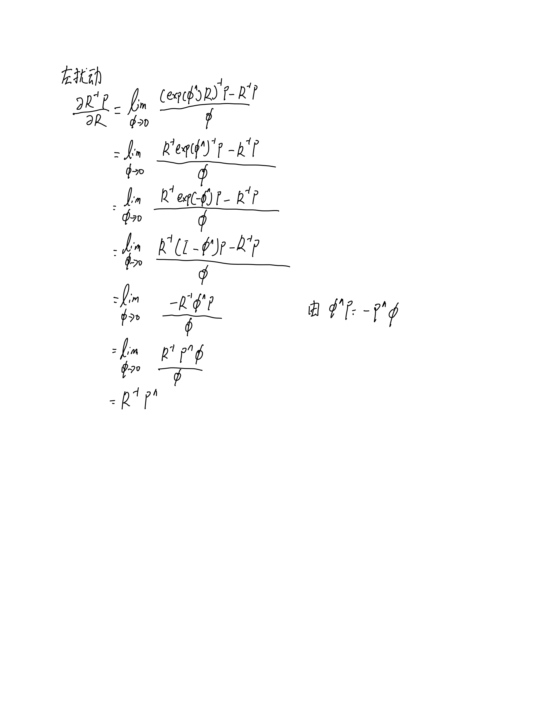
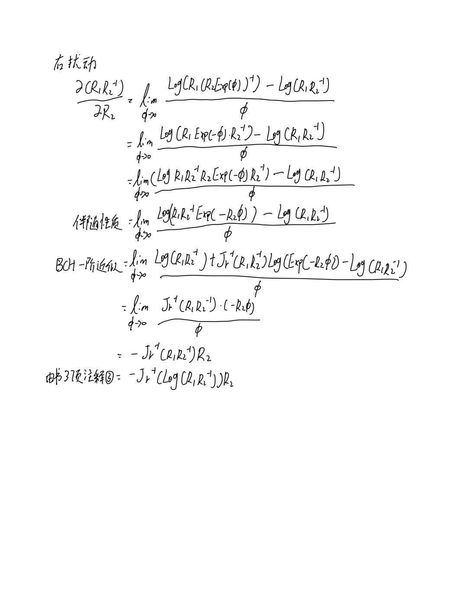

<!--
 * @Description  : 
 * @Author       : zhiwei chen
 * @Date         : 2023-05-20 21:31:17
 * @LastEditors  : zhiwei chen
 * @LastEditTime : 2023-05-25 08:39:30
-->
# 自动驾驶中的SLAM技术第一课作业

## 1 使用左右扰动模型计算
左扰动

右扰动

## 2 使用左右扰动模型计算
左扰动

右扰动

## 3 将实验修改为带旋转的抛物线运动
编程思路：
由于物体受到-Z方向的重力加速度影响，故使用重力加速度乘以时间间隔对v_body本体系速度进行更新

代码直接在ch2文件夹中进行修改，所有修改处均增加TAG标识

下图展示加速度为0.1m/s^2时xy的轨迹，xz的轨迹和yz的轨迹

## 4 高斯牛顿和LM算法在处理非线性迭代的不同
---参考14讲
### 原理和思想:
1. 高斯牛顿法：基于线性化的思想，将非线性问题通过一系列线性化近似转化为最小二乘问题，并利用最小二乘法的求解方法来进行迭代优化。
2. Levenberg-Marquardt算法：结合了最速下降法和高斯牛顿法的思想，通过引入一个参数来平衡两种方法，既能在接近最优点时使用高斯牛顿法的快速收敛性，又能在远离最优点时使用最速下降法的稳定性。
### 迭代更新方式:
1. 高斯牛顿法：使用局部线性化近似的雅可比矩阵（Jacobian matrix）来计算搜索方向，然后进行参数的迭代更新。
2. Levenberg-Marquardt算法：在高斯牛顿法的基础上，引入一个参数（称为阻尼因子）来调整迭代的步长，以控制参数更新的幅度。当阻尼因子较大时，算法更接近于最速下降法；当阻尼因子较小时，算法更接近于高斯牛顿法。
### 迭代流程
1. 高斯牛顿法：

2. Levenberg-Marquardt算法：

## 1.1 错题更新
1. 第一题右扰动推导错误，更正后推导如下

2. 第二题左扰动虽然推导和助教提示中不一样，但是我单独询问了陈梓杰助教，虽然是以左雅克比推导的，但是推导流程没有错
按照右雅克比推导流程如下
