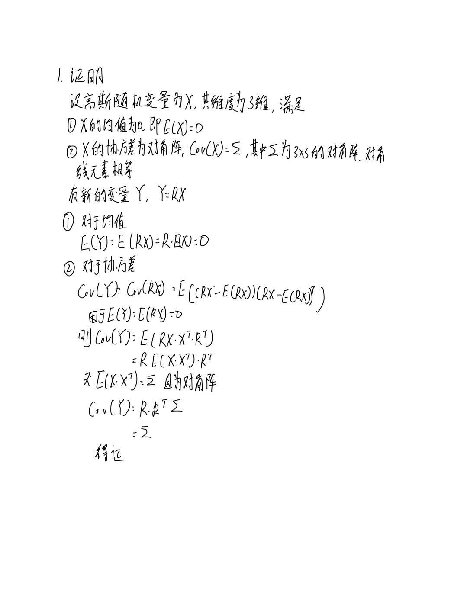
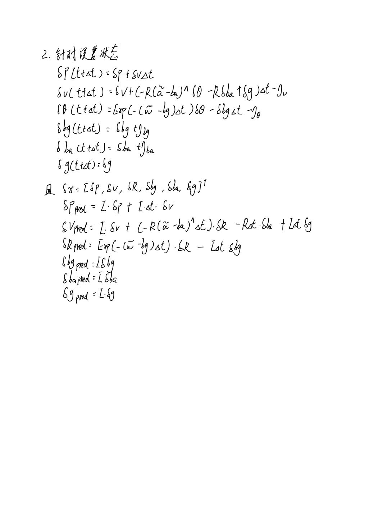
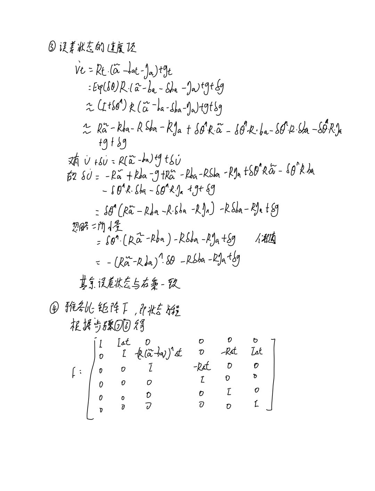
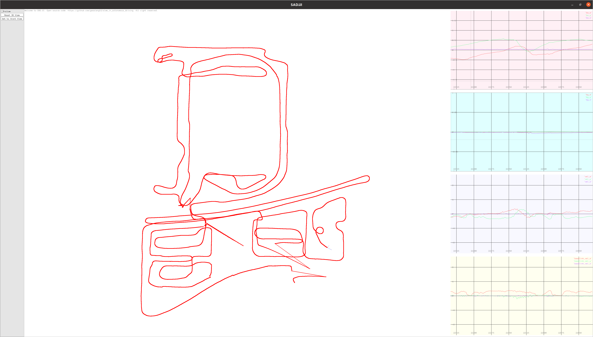

<!--
 * @Description  : r
 * @Author       : zhiwei chen
 * @Date         : 2023-05-28 20:13:32
 * @LastEditors  : zhiwei chen
 * @LastEditTime : 2023-05-28 20:44:42
-->
# 自动驾驶中的SLAM技术第二课作业

## 1 证明：若某个高斯随机变量为零均值，协方差为对角线矩阵且大小相同（各向同性），那么在乘任意旋转矩阵以后，其均值仍为零，且协方差不变；


## 2 在运动过程代码中，将𝑭矩阵拆开，分别为每种状态变量实现运动方程。请给出公式和代码实现的说明
### 2.1 公式推导
  

### 2.2 代码说明
为了针对是否使用F矩阵进行更新，设置了变量，改变量为false时，使用2.1中推导的公式对dx进行更新
``` cpp
DEFINE_bool(with_F_update_error_state, true, "是否使用F矩阵进行更新误差状态");
```
具体的更新代码如下，为了增加可读性，增加了许多临时变量。
``` cpp
    // TAG Problem2 拆开F矩阵来更新dx
    auto dx_update = [&](Vec18T& dx)
    {
        VecT dp, dv, dR, dbg, dba, dg;
        VecT dp_prep, dv_prep, dR_prep, dbg_prep, dba_prep, dg_prep;
        dp = dx.template block<3, 1>(0, 0);
        dv = dx.template block<3, 1>(3, 0);
        dR = dx.template block<3, 1>(6, 0);
        dbg = dx.template block<3, 1>(9, 0);
        dba = dx.template block<3, 1>(12, 0);
        dg = dx.template block<3, 1>(15, 0);

        dp_prep = dp
                  + Mat3T::Identity() * dt * dv;
        dv_prep = dv
                  - R_.matrix() * SO3::hat(imu.acce_ - ba_) * dt * dR
                  - R_.matrix() * dt * dba
                  + Mat3T::Identity() * dt * dg;
        dR_prep = SO3::exp(-(imu.gyro_ - bg_) * dt).matrix() * dR
                  - Mat3T::Identity() * dt * dbg;
        dbg_prep = dbg;
        dba_prep = dba;
        dg_prep = dg;

        dx.template block<3, 1>(0, 0) = dp_prep;
        dx.template block<3, 1>(3, 0) = dv_prep;
        dx.template block<3, 1>(6, 0) = dR_prep;
        dx.template block<3, 1>(9, 0) = dbg_prep;
        dx.template block<3, 1>(12, 0) = dba_prep;
        dx.template block<3, 1>(15, 0) = dg_prep;
    };

    // mean and cov prediction
    // ! 1. 以F矩阵更新
    if (FLAGS_with_F_update_error_state)
        dx_ = F * dx_;
    // ! 2. 分别更新
    else
        dx_update(dx_);
```

## 3 推导左乘模型下的ESKF运动方程、噪声方程，并给出代码实现。
### 3.1 公式推导
  
  


### 3.2 代码说明
为了针对是否使用左扰动进行更新，设置了变量，改变量为true时，使用3.1中推导的公式进行更新
```cpp
DEFINE_bool(with_left_perturbation,true,"是否使用左扰动更新");
```
针对预测进行修改
```cpp
    // TAG Problem3 左扰动更新
    // error state 递推
    // 计算运动过程雅可比矩阵 F，见(3.47)
    // F实际上是稀疏矩阵，也可以不用矩阵形式进行相乘而是写成散装形式，这里为了教学方便，使用矩阵形式
    Mat18T F = Mat18T::Identity();                          // 主对角线
    F.template block<3, 3>(0, 3) = Mat3T::Identity() * dt;  // p 对 v

    if (FLAGS_with_left_perturbation)
        F.template block<3, 3>(3, 6) = -SO3::hat(R_.matrix() * (imu.acce_ - ba_)) * dt;  // v对theta
    else
        F.template block<3, 3>(3, 6) = -R_.matrix() * SO3::hat(imu.acce_ - ba_) * dt;  // v对theta

    F.template block<3, 3>(3, 12) = -R_.matrix() * dt;       // v 对 ba
    F.template block<3, 3>(3, 15) = Mat3T::Identity() * dt;  // v 对 g

    if (FLAGS_with_left_perturbation)
        F.template block<3, 3>(6, 6) = Mat3T::Identity();  // theta 对 theta
    else
        F.template block<3, 3>(6, 6) = SO3::exp(-(imu.gyro_ - bg_) * dt).matrix();  // theta 对 theta

    if (FLAGS_with_left_perturbation)
        F.template block<3, 3>(6, 9) = -R_.matrix() * dt;
    else
        F.template block<3, 3>(6, 9) = -Mat3T::Identity() * dt;  // theta 对 bg
```
针对观测进行修改
```cpp
    // TAG Problem3 左扰动更新
    // 更新x和cov
    Vec6d innov = Vec6d::Zero();
    innov.template head<3>() = (pose.translation() - p_);  // 平移部分
    if (FLAGS_with_left_perturbation)
        innov.template tail<3>() = (pose.so3() * R_.inverse()).log();  // 旋转部分(3.67)
    else
        innov.template tail<3>() = (R_.inverse() * pose.so3()).log();  // 旋转部分(3.67)
```
针对名义状态变量更新进行修改
```cpp

    /// 更新名义状态变量，重置error state
    void UpdateAndReset()
    {
        // TAG Problem3 左扰动更新
        p_ += dx_.template block<3, 1>(0, 0);
        v_ += dx_.template block<3, 1>(3, 0);
        if (FLAGS_with_left_perturbation)
            R_ = SO3::exp(dx_.template block<3, 1>(6, 0)) * R_;
        else
            R_ = R_ * SO3::exp(dx_.template block<3, 1>(6, 0));

        if (options_.update_bias_gyro_)
        {
            bg_ += dx_.template block<3, 1>(9, 0);
        }

        if (options_.update_bias_acce_)
        {
            ba_ += dx_.template block<3, 1>(12, 0);
        }

        g_ += dx_.template block<3, 1>(15, 0);

        ProjectCov();
        dx_.setZero();
    }

    /// 对P阵进行投影，参考式(3.63)
    void ProjectCov()
    {
        Mat18T J = Mat18T::Identity();
        // TAG Problem3 左扰动更新
        if (FLAGS_with_left_perturbation)
            J.template block<3, 3>(6, 6) = Mat3T::Identity() + 0.5 * SO3::hat(dx_.template block<3, 1>(6, 0));
        else
            J.template block<3, 3>(6, 6) = Mat3T::Identity() - 0.5 * SO3::hat(dx_.template block<3, 1>(6, 0));
        cov_ = J * cov_ * J.transpose();
    }
```
使用左扰动的轨迹如下，可以看出，该轨迹与右扰动一致
  
