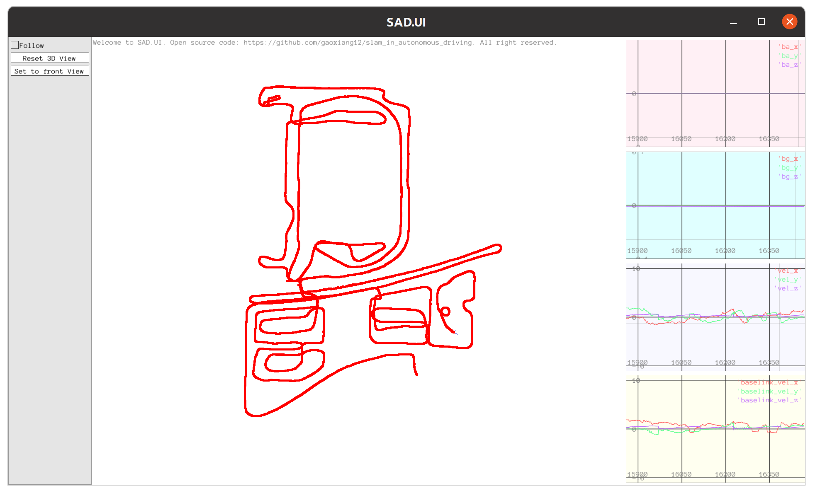

<!--
 * @Description  : r
 * @Author       : zhiwei chen
 * @Date         : 2023-05-28 20:13:32
 * @LastEditors  : zhiwei chen
 * @LastEditTime : 2023-06-10 22:33:59
-->
# 自动驾驶中的SLAM技术第三课作业

## 1 推导等式（书中式4.48d）
参考速度与旋转部分的推导  
$$
\begin{aligned}
\boldsymbol{r}_{\Delta \boldsymbol{p}_{i j}}\left(\boldsymbol{R}_{i} \operatorname{Exp}\left(\delta \boldsymbol{\phi}_{i}\right)\right) & =\left(\boldsymbol{R}_{i} \operatorname{Exp}\left(\delta \boldsymbol{\phi}_{i}\right)\right)^{\top} (\boldsymbol{p}_{j}-\boldsymbol{p}_{i}-\boldsymbol{v}_{i} \Delta t_{i j}-\frac{1}{2} \boldsymbol{g} \Delta t_{i j}^{2}) -\Delta \tilde{\boldsymbol{p}}_{i j} \\
& = (\boldsymbol{I}-\delta \boldsymbol{\phi}_{i}^{\wedge}) \bm R_i^ \top (\boldsymbol{p}_{j}-\boldsymbol{p}_{i}-\boldsymbol{v}_{i} \Delta t_{i j}-\frac{1}{2} \boldsymbol{g} \Delta t_{i j}^{2}) -\Delta \tilde{\boldsymbol{p}}_{i j} \\
& = \bm R_i^ \top (\boldsymbol{p}_{j}-\boldsymbol{p}_{i}-\boldsymbol{v}_{i} \Delta t_{i j}-\frac{1}{2} \boldsymbol{g} \Delta t_{i j}^{2}) -\Delta \tilde{\boldsymbol{p}}_{i j} - \delta \boldsymbol{\phi}_{i}^{\wedge} \bm R_i^ \top (\boldsymbol{p}_{j}-\boldsymbol{p}_{i}-\boldsymbol{v}_{i} \Delta t_{i j}-\frac{1}{2} \boldsymbol{g} \Delta t_{i j}^{2}) \\
& = \boldsymbol{r}_{\Delta \boldsymbol{p}_{i j}}\left(\boldsymbol{R}_{i} \right) + (\bm R_i^ \top (\boldsymbol{p}_{j}-\boldsymbol{p}_{i}-\boldsymbol{v}_{i} \Delta t_{i j}-\frac{1}{2} \boldsymbol{g} \Delta t_{i j}^{2}))^{\wedge}\delta \boldsymbol{\phi}_{i}
\end{aligned}
$$
则其雅克比为
$$
\frac{\partial \boldsymbol{r}_{\Delta \boldsymbol{p}_{i j}}}{\partial \boldsymbol{\phi}_{i}}  =\left(\boldsymbol{R}_{i}^{\top}\left(\boldsymbol{p}_{j}-\boldsymbol{p}_{i}-\boldsymbol{v}_{i} \Delta t_{i j}-\frac{1}{2} \boldsymbol{g} \Delta t_{i j}^{2}\right)\right)^{\wedge} 
$$

## 2 实现由Odom数据触发的图优化（g2o）
思路：
1. 为了防止Odom和GNSS连着进来的时候导致imu积分失败，增加上次数据的标识符号，表明上次数据类型
```cpp
    enum
    {
        imu_,
        gnss_,
        odom_
    };

    int last_data_sign_ = -1;
```
2. 根据数据的先后不同采用不同的优化方式，主要有以下4种   
(1). 上一帧GNSS，当前帧GNSS：添加两个GNSS约束  
(2). 上一帧GNSS，当前帧Odom：添加上一帧GNSS约束，一个速度约束  
(3). 上一帧Odom，当前帧Odom：添加速度约束  
(4). 上一帧Odom，当前帧GNSS：添加当前帧的GNSS约束，一个速度约束  
注意: 与助教提示不同,这里并非只通过odom触发,而是gnss和odom均可触发优化,这样可以避免单一传感器长时间的无数据输入,同时通过减少约束的形式来避免对数据进行线性插值
是否增加GNSS约束通过下面代码实现
```cpp
    if (last_data_sign_ == gnss_)
    {
        auto edge_gnss0 = new EdgeGNSS(v0_pose, last_gnss_.utm_pose_);
        edge_gnss0->setInformation(options_.gnss_info_);
        optimizer.addEdge(edge_gnss0);
    }

    if (now_data_sign == gnss_)
    {
        auto edge_gnss1 = new EdgeGNSS(v1_pose, this_gnss_.utm_pose_);
        edge_gnss1->setInformation(options_.gnss_info_);
        optimizer.addEdge(edge_gnss1);
    }
```
是否增加Odom约束通过下面代码实现
```cpp
        if (last_data_sign_ == odom_)
        {
            // velocity obs
            double velo_l =
                options_.wheel_radius_ * last_odom_.left_pulse_ / options_.circle_pulse_ * 2 * M_PI / options_.odom_span_;
            double velo_r =
                options_.wheel_radius_ * last_odom_.right_pulse_ / options_.circle_pulse_ * 2 * M_PI / options_.odom_span_;
            double average_vel = 0.5 * (velo_l + velo_r);
            vel_odom = Vec3d(average_vel, 0.0, 0.0);
            vel_world = this_frame_->R_ * vel_odom;

            edge_odom = new EdgeEncoder3D(v0_vel, vel_world);
            edge_odom->setInformation(options_.odom_info_);
            optimizer.addEdge(edge_odom);
        }

        if (now_data_sign == odom_)
        {
            // velocity obs
            double velo_l =
                options_.wheel_radius_ * last_odom_.left_pulse_ / options_.circle_pulse_ * 2 * M_PI / options_.odom_span_;
            double velo_r =
                options_.wheel_radius_ * last_odom_.right_pulse_ / options_.circle_pulse_ * 2 * M_PI / options_.odom_span_;
            double average_vel = 0.5 * (velo_l + velo_r);
            vel_odom = Vec3d(average_vel, 0.0, 0.0);
            vel_world = this_frame_->R_ * vel_odom;

            edge_odom = new EdgeEncoder3D(v1_vel, vel_world);
            edge_odom->setInformation(options_.odom_info_);
            optimizer.addEdge(edge_odom);
        }
```

结果如下图所示  

可以看出对比只在GNSS进行优化的情况轨迹少了突变

## 3 利用数值求导工具，验证本书实验中的雅可比矩阵的正确性
思路:
使用中心差分进行数值求导数,代码如下
```cpp
    const double eps = 1e-6;
    /// 残差对R1, 9x3
    // dR/dR1, 4.42
    auto dR_dR1_error_J = [&]()
    {
        Eigen::Matrix<double, 3, 3> numerical_jacobian;
        // 计算每个分量上的变化率
        for (int i = 0; i < 3; ++i)
        {
            Eigen::Vector3d perturbation_R = Eigen::Vector3d::Zero();
            perturbation_R(i) = eps;

            const SO3 R1_1 = R1 * Sophus::SO3d::exp(perturbation_R);
            const SO3 eR1 = SO3(dR).inverse() * (R1_1.inverse()) * R2;
            const Vec3d er1 = eR1.log();

            const SO3 R1_2 = R1 * Sophus::SO3d::exp(-perturbation_R);
            const SO3 eR2 = SO3(dR).inverse() * (R1_2.inverse()) * R2;
            const Vec3d er2 = eR2.log();

            Vec3d dv = er1 - er2;
            numerical_jacobian.col(i) = dv / (2 * eps);

            LOG(INFO) << std::endl
                      << "dR/dR1: "
                      << std::endl
                      << "Analytical Jacobian is"
                      << std::endl
                      << -invJr * (R2.inverse() * R1).matrix()
                      << std::endl
                      << "Numerical Jacobian is"
                      << std::endl
                      << numerical_jacobian
                      << std::endl;
        }
    };
    // dv/dR1, 4.47
    auto dv_dR1_error_J = [&]()
    {
        Eigen::Matrix<double, 3, 3> numerical_jacobian;
        // 计算每个分量上的变化率
        for (int i = 0; i < 3; ++i)
        {
            Eigen::Vector3d perturbation_R = Eigen::Vector3d::Zero();
            perturbation_R(i) = eps;

            const SO3 R1_1 = R1 * Sophus::SO3d::exp(perturbation_R);
            Mat3d RiT1 = R1_1.inverse().matrix();
            const Vec3d ev1 = RiT1 * (v2->estimate() - v1->estimate() - grav_ * dt_) - dv;

            const SO3 R1_2 = R1 * Sophus::SO3d::exp(-perturbation_R);
            Mat3d RiT2 = R1_2.inverse().matrix();
            const Vec3d ev2 = RiT2 * (v2->estimate() - v1->estimate() - grav_ * dt_) - dv;

            Vec3d dv = ev1 - ev2;
            numerical_jacobian.col(i) = dv / (2 * eps);

            LOG(INFO) << std::endl
                      << "dv/dR1: "
                      << std::endl
                      << "Analytical Jacobian is"
                      << std::endl
                      << SO3::hat(R1T * (vj - vi - grav_ * dt_))
                      << std::endl
                      << "Numerical Jacobian is"
                      << std::endl
                      << numerical_jacobian
                      << std::endl;
        }
    };
    // dp/dR1, 4.48d
    auto dp_dR1_error_J = [&]()
    {
        Eigen::Matrix<double, 3, 3> numerical_jacobian;
        // 计算每个分量上的变化率
        for (int i = 0; i < 3; ++i)
        {
            Eigen::Vector3d perturbation_R = Eigen::Vector3d::Zero();
            perturbation_R(i) = eps;

            const SO3 R1_1 = R1 * Sophus::SO3d::exp(perturbation_R);
            Mat3d RiT1 = R1_1.inverse().matrix();
            const Vec3d ep1 = RiT1 * (p2->estimate().translation() - p1->estimate().translation() - v1->estimate() * dt_ - grav_ * dt_ * dt_ / 2) - dp;

            const SO3 R1_2 = R1 * Sophus::SO3d::exp(-perturbation_R);
            Mat3d RiT2 = R1_2.inverse().matrix();
            const Vec3d ep2 = RiT2 * (p2->estimate().translation() - p1->estimate().translation() - v1->estimate() * dt_ - grav_ * dt_ * dt_ / 2) - dp;

            Vec3d dv = ep1 - ep2;
            numerical_jacobian.col(i) = dv / (2 * eps);

            LOG(INFO) << std::endl
                      << "dp/dR1: "
                      << std::endl
                      << "Analytical Jacobian is"
                      << std::endl
                      << SO3::hat(R1T * (pj - pi - v1->estimate() * dt_ - 0.5 * grav_ * dt_ * dt_))
                      << std::endl
                      << "Numerical Jacobian is"
                      << std::endl
                      << numerical_jacobian
                      << std::endl;
        }
    };

    /// 残差对p1, 9x3
    // dp/dp1, 4.48a
    auto dp_dp1_error_J = [&]()
    {
        Eigen::Matrix<double, 3, 3> numerical_jacobian;
        // 计算每个分量上的变化率
        for (int i = 0; i < 3; ++i)
        {
            Vec3d p1_1 = p1->estimate().translation();
            p1_1(i) += eps;
            const Vec3d ep1 = RiT * (p2->estimate().translation() - p1_1 - v1->estimate() * dt_ - grav_ * dt_ * dt_ / 2) - dp;

            Vec3d p1_2 = p1->estimate().translation();
            p1_2(i) -= eps;
            const Vec3d ep2 = RiT * (p2->estimate().translation() - p1_2 - v1->estimate() * dt_ - grav_ * dt_ * dt_ / 2) - dp;

            Vec3d dv = ep1 - ep2;
            numerical_jacobian.col(i) = dv / (2 * eps);
        }

        LOG(INFO) << std::endl
                  << "dp/dp1: "
                  << std::endl
                  << "Analytical Jacobian is"
                  << std::endl
                  << -R1T.matrix()
                  << std::endl
                  << "Numerical Jacobian is"
                  << std::endl
                  << numerical_jacobian
                  << std::endl;
    };

    /// 残差对v1, 9x3
    // dv/dv1, 4.46a
    auto dv_dv1_error_J = [&]()
    {
        Eigen::Matrix<double, 3, 3> numerical_jacobian;
        // 计算每个分量上的变化率
        for (int i = 0; i < 3; ++i)
        {
            Vec3d v1_1 = v1->estimate();
            v1_1(i) += eps;
            const Vec3d ev1 = RiT * (v2->estimate() - v1_1 - grav_ * dt_) - dv;

            Vec3d v1_2 = v1->estimate();
            v1_2(i) -= eps;
            const Vec3d ev2 = RiT * (v2->estimate() - v1_2 - grav_ * dt_) - dv;

            Vec3d dv = ev1 - ev2;
            numerical_jacobian.col(i) = dv / (2 * eps);
        }

        LOG(INFO) << std::endl
                  << "dv/dv1: "
                  << std::endl
                  << "Analytical Jacobian is"
                  << std::endl
                  << -R1T.matrix()
                  << std::endl
                  << "Numerical Jacobian is"
                  << std::endl
                  << numerical_jacobian
                  << std::endl;
    };
    // dp/dv1, 4.48c
    auto dp_dv1_error_J = [&]()
    {
        Eigen::Matrix<double, 3, 3> numerical_jacobian;
        // 计算每个分量上的变化率
        for (int i = 0; i < 3; ++i)
        {
            Vec3d v1_1 = v1->estimate();
            v1_1(i) += eps;
            const Vec3d ep1 = RiT * (p2->estimate().translation() - p1->estimate().translation() - v1_1 * dt_ - grav_ * dt_ * dt_ / 2) - dp;

            Vec3d v1_2 = v1->estimate();
            v1_2(i) -= eps;
            const Vec3d ep2 = RiT * (p2->estimate().translation() - p1->estimate().translation() - v1_2 * dt_ - grav_ * dt_ * dt_ / 2) - dp;

            Vec3d dv = ep1 - ep2;
            numerical_jacobian.col(i) = dv / (2 * eps);
        }

        LOG(INFO) << std::endl
                  << "dp/dv1: "
                  << std::endl
                  << "Analytical Jacobian is"
                  << std::endl
                  << -R1T.matrix() * dt_
                  << std::endl
                  << "Numerical Jacobian is"
                  << std::endl
                  << numerical_jacobian
                  << std::endl;
    };

    /// 残差对bg1
    // dR/dbg1, 4.45
    auto dR_dbg1_error_J = [&]()
    {
        Eigen::Matrix<double, 3, 3> numerical_jacobian;
        // 计算每个分量上的变化率
        for (int i = 0; i < 3; ++i)
        {
            Vec3d bg1 = bg;
            bg1(i) += eps;
            const SO3 dR1 = preint_->GetDeltaRotation(bg1);
            const Vec3d er1 = (dR1.inverse() * p1->estimate().so3().inverse() * p2->estimate().so3()).log();

            Vec3d bg2 = bg;
            bg2(i) -= eps;
            const SO3 dR2 = preint_->GetDeltaRotation(bg2);
            const Vec3d er2 = (dR2.inverse() * p1->estimate().so3().inverse() * p2->estimate().so3()).log();

            Vec3d dv = er1 - er2;
            numerical_jacobian.col(i) = dv / (2 * eps);
        }

        LOG(INFO) << std::endl
                  << "dR/dbg1: "
                  << std::endl
                  << "Analytical Jacobian is"
                  << std::endl
                  << -invJr * eR.inverse().matrix() * SO3::jr((dR_dbg * dbg).eval()) * dR_dbg
                  << std::endl
                  << "Numerical Jacobian is"
                  << std::endl
                  << numerical_jacobian
                  << std::endl;
    };
    // dv/dbg1
    auto dv_dbg1_error_J = [&]()
    {
        Eigen::Matrix<double, 3, 3> numerical_jacobian;
        // 计算每个分量上的变化率
        for (int i = 0; i < 3; ++i)
        {
            Vec3d bg1 = bg;
            bg1(i) += eps;
            const Vec3d dv1 = preint_->GetDeltaVelocity(bg1, ba);
            const Vec3d ev1 = RiT * (v2->estimate() - v1->estimate() - grav_ * dt_) - dv1;

            Vec3d bg2 = bg;
            bg2(i) -= eps;
            const Vec3d dv2 = preint_->GetDeltaVelocity(bg2, ba);
            const Vec3d ev2 = RiT * (v2->estimate() - v1->estimate() - grav_ * dt_) - dv2;

            Vec3d dv = ev1 - ev2;
            numerical_jacobian.col(i) = dv / (2 * eps);
        }

        LOG(INFO) << std::endl
                  << "dv/dbg1: "
                  << std::endl
                  << "Analytical Jacobian is"
                  << std::endl
                  << -dv_dbg
                  << std::endl
                  << "Numerical Jacobian is"
                  << std::endl
                  << numerical_jacobian
                  << std::endl;
    };
    // dp/dbg1
    auto dp_dbg1_error_J = [&]()
    {
        Eigen::Matrix<double, 3, 3> numerical_jacobian;
        // 计算每个分量上的变化率
        for (int i = 0; i < 3; ++i)
        {
            Vec3d bg1 = bg;
            bg1(i) += eps;
            const Vec3d dp1 = preint_->GetDeltaPosition(bg1, ba);
            const Vec3d ep1 = RiT * (p2->estimate().translation() - p1->estimate().translation() - v1->estimate() * dt_ - grav_ * dt_ * dt_ / 2) - dp1;

            Vec3d bg2 = bg;
            bg2(i) -= eps;
            const Vec3d dp2 = preint_->GetDeltaPosition(bg2, ba);
            const Vec3d ep2 = RiT * (p2->estimate().translation() - p1->estimate().translation() - v1->estimate() * dt_ - grav_ * dt_ * dt_ / 2) - dp2;

            Vec3d dv = ep1 - ep2;
            numerical_jacobian.col(i) = dv / (2 * eps);
        }

        LOG(INFO) << std::endl
                  << "dp/dbg1: "
                  << std::endl
                  << "Analytical Jacobian is"
                  << std::endl
                  << -dp_dbg
                  << std::endl
                  << "Numerical Jacobian is"
                  << std::endl
                  << numerical_jacobian
                  << std::endl;
    };

    /// 残差对ba1
    // dv/dba1
    auto dv_dba1_error_J = [&]()
    {
        Eigen::Matrix<double, 3, 3> numerical_jacobian;
        // 计算每个分量上的变化率
        for (int i = 0; i < 3; ++i)
        {
            Vec3d ba1 = ba;
            ba1(i) += eps;
            const Vec3d dv1 = preint_->GetDeltaVelocity(bg, ba1);
            const Vec3d ev1 = RiT * (v2->estimate() - v1->estimate() - grav_ * dt_) - dv1;

            Vec3d ba2 = ba;
            ba2(i) -= eps;
            const Vec3d dv2 = preint_->GetDeltaVelocity(bg, ba2);
            const Vec3d ev2 = RiT * (v2->estimate() - v1->estimate() - grav_ * dt_) - dv2;

            Vec3d dv = ev1 - ev2;
            numerical_jacobian.col(i) = dv / (2 * eps);
        }

        LOG(INFO) << std::endl
                  << "dv/dba1: "
                  << std::endl
                  << "Analytical Jacobian is"
                  << std::endl
                  << -dv_dba
                  << std::endl
                  << "Numerical Jacobian is"
                  << std::endl
                  << numerical_jacobian
                  << std::endl;
    };
    // dp/dba1
    auto dp_dba1_error_J = [&]()
    {
        Eigen::Matrix<double, 3, 3> numerical_jacobian;
        // 计算每个分量上的变化率
        for (int i = 0; i < 3; ++i)
        {
            Vec3d ba1 = ba;
            ba1(i) += eps;
            const Vec3d dp1 = preint_->GetDeltaPosition(bg, ba1);
            const Vec3d ep1 = RiT * (p2->estimate().translation() - p1->estimate().translation() - v1->estimate() * dt_ - grav_ * dt_ * dt_ / 2) - dp1;

            Vec3d ba2 = ba;
            ba2(i) -= eps;
            const Vec3d dp2 = preint_->GetDeltaPosition(bg, ba2);
            const Vec3d ep2 = RiT * (p2->estimate().translation() - p1->estimate().translation() - v1->estimate() * dt_ - grav_ * dt_ * dt_ / 2) - dp2;

            Vec3d dv = ep1 - ep2;
            numerical_jacobian.col(i) = dv / (2 * eps);
        }

        LOG(INFO) << std::endl
                  << "dp/dba1: "
                  << std::endl
                  << "Analytical Jacobian is"
                  << std::endl
                  << -dp_dba
                  << std::endl
                  << "Numerical Jacobian is"
                  << std::endl
                  << numerical_jacobian
                  << std::endl;
    };

    /// 残差对pose2
    // dr/dr2, 4.43
    // _jacobianOplus[4].block<3, 3>(0, 0) = invJr;
    auto dR_dR2_error_J = [&]()
    {
        Eigen::Matrix<double, 3, 3> numerical_jacobian;
        // 计算每个分量上的变化率
        for (int i = 0; i < 3; ++i)
        {
            Eigen::Vector3d perturbation_R = Eigen::Vector3d::Zero();
            perturbation_R(i) = eps;

            const SO3 R2_1 = R2 * Sophus::SO3d::exp(perturbation_R);
            const SO3 eR1 = SO3(dR).inverse() * R1T * R2_1;
            const Vec3d er1 = eR1.log();

            const SO3 R2_2 = R2 * Sophus::SO3d::exp(-perturbation_R);
            const SO3 eR2 = SO3(dR).inverse() * R1T * R2_2;
            const Vec3d er2 = eR2.log();

            Vec3d dv = er1 - er2;
            numerical_jacobian.col(i) = dv / (2 * eps);

            LOG(INFO) << std::endl
                      << "dR/dR2: "
                      << std::endl
                      << "Analytical Jacobian is"
                      << std::endl
                      << invJr
                      << std::endl
                      << "Numerical Jacobian is"
                      << std::endl
                      << numerical_jacobian
                      << std::endl;
        }
    };
    // dp/dp2, 4.48b
    auto dp_dp2_error_J = [&]()
    {
        Eigen::Matrix<double, 3, 3> numerical_jacobian;
        // 计算每个分量上的变化率
        for (int i = 0; i < 3; ++i)
        {
            Vec3d p2_1 = p2->estimate().translation();
            p2_1(i) += eps;
            const Vec3d ep1 = RiT * (p2_1 - p1->estimate().translation() - v1->estimate() * dt_ - grav_ * dt_ * dt_ / 2) - dp;

            Vec3d p2_2 = p2->estimate().translation();
            p2_2(i) -= eps;
            const Vec3d ep2 = RiT * (p2_2 - p1->estimate().translation() - v1->estimate() * dt_ - grav_ * dt_ * dt_ / 2) - dp;

            Vec3d dv = ep1 - ep2;
            numerical_jacobian.col(i) = dv / (2 * eps);
        }

        LOG(INFO) << std::endl
                  << "dp/dp2: "
                  << std::endl
                  << "Analytical Jacobian is"
                  << std::endl
                  << R1T.matrix()
                  << std::endl
                  << "Numerical Jacobian is"
                  << std::endl
                  << numerical_jacobian
                  << std::endl;
    };

    /// 残差对v2
    // dv/dv2, 4,46b
    auto dv_dv2_error_J = [&]()
    {
        Eigen::Matrix<double, 3, 3> numerical_jacobian;
        // 计算每个分量上的变化率
        for (int i = 0; i < 3; ++i)
        {
            Vec3d v2_1 = v2->estimate();
            v2_1(i) += eps;
            const Vec3d ev1 = RiT * (v2_1 - v1->estimate() - grav_ * dt_) - dv;

            Vec3d v2_2 = v2->estimate();
            v2_2(i) -= eps;
            const Vec3d ev2 = RiT * (v2_2 - v1->estimate() - grav_ * dt_) - dv;

            Vec3d dv = ev1 - ev2;
            numerical_jacobian.col(i) = dv / (2 * eps);
        }

        LOG(INFO) << std::endl
                  << "dv/dv2: "
                  << std::endl
                  << "Analytical Jacobian is"
                  << std::endl
                  << R1T.matrix()
                  << std::endl
                  << "Numerical Jacobian is"
                  << std::endl
                  << numerical_jacobian
                  << std::endl;
    };

    LOG(INFO)<< "begin";
    dR_dR1_error_J();
    dv_dR1_error_J();
    dp_dR1_error_J();

    dp_dp1_error_J();

    dv_dv1_error_J();
    dp_dv1_error_J();

    dR_dbg1_error_J();
    dv_dbg1_error_J();
    dp_dbg1_error_J();

    dv_dba1_error_J();
    dp_dba1_error_J();

    dR_dR2_error_J();
    dp_dp2_error_J();

    dv_dv2_error_J();
    LOG(INFO)<< "end";
```

结果如下所示  
通过数值计算的雅可比中有一些小于e-10的量,可以等同于0,可以看出,两种方式计算的雅可比相等  
Ps. 测试的时候如果同时输出所有的信息,会存在打印错乱的情况,故测试仅按照一一对照测试
```
dR/dR1: 
Analytical Jacobian is
00-0.999986 00.00446288 -0.00295614
-0.00447727 00-0.999978 000.0048764
00.00293432 -0.00488957 00-0.999984
Numerical Jacobian is
00-0.999986 00.00446288 -0.00295614
-0.00447727 00-0.999978 000.0048764
00.00293432 -0.00488957 00-0.999984

dv/dR1: 
Analytical Jacobian is
000000000 00-3.0034 000.02177
0003.0034 000000000 -0.082469
0-0.02177 00.082469 000000000
Numerical Jacobian is
-6.93889e-12 00000-3.0034 000000000000
0000003.0034 0-1.9082e-11 000000000000
0000-0.02177 00000.082469 00000.166667

dp/dR1: 
Analytical Jacobian is
00000000000 00-0.457586 00.00446029
0000.457586 00000000000 -0.00656202
-0.00446029 00.00656202 00000000000
Numerical Jacobian is
-8.67362e-13 000-0.457586 000.00446029
00000.457586 -1.30104e-12 0-0.00656202
0-0.00446029 000.00656202 000000000000

dp/dp1: 
Analytical Jacobian is
0000.274282 00-0.961646 00.00239719
0000.961646 0000.274274 -0.00344076
-0.00265131 -0.00324898 00-0.999991
Numerical Jacobian is
0000.274282 00-0.961646 00.00239719
0000.961646 0000.274274 -0.00344076
-0.00265131 -0.00324898 00-0.999991

dv/dv1: 
Analytical Jacobian is
0000.274282 00-0.961646 00.00239719
0000.961646 0000.274274 -0.00344076
-0.00265131 -0.00324898 00-0.999991
Numerical Jacobian is
0000.274282 00-0.961646 00.00239719
0000.961646 0000.274274 -0.00344076
0-0.0026513 -0.00324898 00-0.999991

dp/dv1: 
Analytical Jacobian is
00000.083181 000-0.291636 00.000726989
00000.291636 0000.0831783 0-0.00104347
-0.000804055 -0.000985311 000-0.303265
Numerical Jacobian is
00000.083181 000-0.291636 00.000726989
00000.291636 0000.0831783 0-0.00104347
-0.000804055 -0.000985311 000-0.303265

dR/dbg1: 
Analytical Jacobian is
00000.303266 -0.000698732 00.000704828
00.000700248 00000.303266 -0.000491347
-0.000703267 00.000493381 00000.303266
Numerical Jacobian is
00000.303266 -0.000698732 00.000704828
00.000700248 00000.303266 -0.000491347
-0.000703267 00.000493381 00000.303266

dv/dbg1: 
Analytical Jacobian is
-0.000649963 00000.438349 -0.000915145
000-0.438344 -0.000697355 0000.0179824
000.00207552 00-0.0180217 0-5.1881e-05
Numerical Jacobian is
-0.000649963 00000.438349 -0.000915145
000-0.438344 -0.000697355 0000.0179824
000.00207552 00-0.0180217 -5.18809e-05

dp/dbg1: 
Analytical Jacobian is
-5.51969e-05 0000.0435329 000.00026791
00-0.0435339 -5.86461e-05 000.00145122
-0.000169164 00-0.0014683 -3.93699e-06
Numerical Jacobian is
-5.51969e-05 0000.0435329 000.00026791
00-0.0435339 -5.86461e-05 000.00145122
-0.000169164 00-0.0014683 -3.93699e-06

dv/dba1: 
Analytical Jacobian is
00000.303266 00.000634923 -0.000172808
-0.000634006 00000.303265 00.000964279
00.000175268 -0.000963526 00000.303266
Numerical Jacobian is
00000.303266 00.000634923 -0.000172808
-0.000634006 00000.303265 00.000964279
00.000175268 -0.000963526 00000.303266

dp/dba1: 
Analytical Jacobian is
0000.0459856 06.57854e-05 04.64327e-06
-6.57704e-05 0000.0459854 000.00011472
-4.43591e-06 -0.000114714 0000.0459855
Numerical Jacobian is
0000.0459856 06.57854e-05 04.64327e-06
-6.57704e-05 0000.0459854 000.00011472
0-4.4359e-06 -0.000114714 0000.0459855

dR/dR2: 
Analytical Jacobian is
000000000001 03.19119e-06 07.71192e-07
-3.19119e-06 000000000001 -1.21329e-06
-7.71195e-07 01.21329e-06 000000000001
Numerical Jacobian is
000000000001 03.19119e-06 07.71192e-07
-3.19119e-06 000000000001 -1.21329e-06
0-7.7119e-07 01.21314e-06 000000000001

dp/dp2: 
Analytical Jacobian is
00-0.274282 0000.961646 -0.00239719
00-0.961646 00-0.274274 00.00344076
00.00265131 00.00324898 0000.999991
Numerical Jacobian is
00-0.274282 0000.961646 -0.00239719
00-0.961646 00-0.274274 00.00344076
00.00265131 00.00324898 0000.999991

dv/dv2: 
Analytical Jacobian is
00-0.274282 0000.961646 -0.00239719
00-0.961646 00-0.274274 00.00344076
00.00265131 00.00324898 0000.999991
Numerical Jacobian is
00-0.274282 0000.961646 -0.00239719
00-0.961646 00-0.274274 00.00344076
000.0026513 00.00324898 0000.999991
```